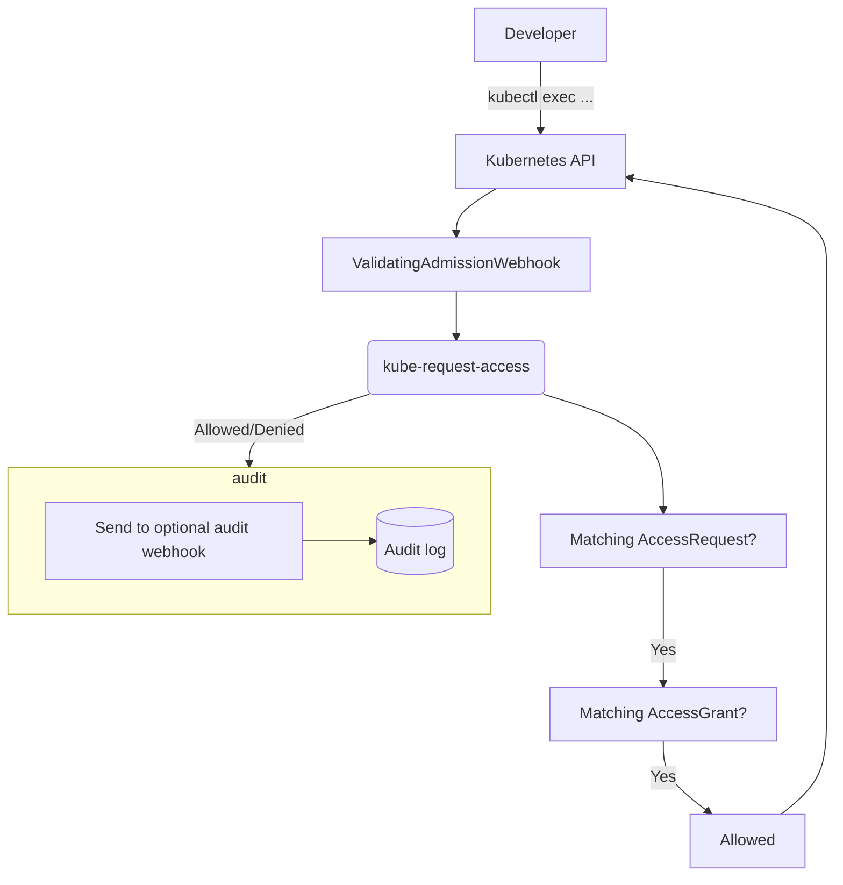

# kube-request-access -- **retired**

**Status**: ~~alpha, in-use but not widely tested.~~  ⚠️ **retired**. ⚠️  (was not used by developers and in the way sometimes.  feel free to revive it) 

Let's make `kubectl exec` and friends auditable!

`kube-request-access` provides audited and manually approved access to `kubectl exec` for developers.
It works using a custom [ValidatingAdmissionWebhook](https://kubernetes.io/docs/reference/access-authn-authz/admission-controllers/#validatingadmissionwebhook)
that verifies that a user has the required permissions using the `AccessRequest` and `AccessGrant` CRDs.
The process is auditable and extendable using additional custom webhooks, e.g. to require that custom
fields are set on those CRDs.

This project is inspired by the internal `zkubectl cluster-access` [in use at Zalando](https://www.youtube.com/watch?v=4EGTa8u-7Ws&t=1535).

Here's what the workflow looks like in practice:

[](https://asciinema.org/a/580126)

## Usage

### For developers

To request exec access in a cluster, install [kubectl-request](https://github.com/spreadshirt/kube-request-access/releases) and then request access as follows:

```
$ kubectl request exec --valid-for 1h nginx-7fb96c846b-pcnxl -- cat '/my/app/config/*'
created accessrequest ... (please wait for an admin to grant the permission)

# after the request is granted
$ kubectl exec nginx-7fb96c846b-pcnxl -- cat '/my/app/config/*'
...
```

See [`kubectl-request` docs](./cmd/kubectl-request) docs for more details.

### For operators

See [Architecture](#architecture) and [Deployment](#deployment) sections below.

## Architecture



- `kube-request-access` intercepts `AccessRequest`s, `AccessGrant`s and `pods/exec` API calls and decides
  if they are valid
- developers request access using `kubectl request exec` and admins grant it using `kubectl request grant` ([`kubectl-request`](./cmd/kubectl-request) plugin)
- `kube-request-access` can defer to custom webhooks to implement organization-specific auditing and additional
  validation, e.g. to store auditing information in a database or send notifications to a chat

### Design decisions

- all objects should be managed using the Kubernetes API (`kube-request-access` itself is stateless, all state is in the Kubernetes API using CRDs)
- this project should not contain organization-specific integrations, anything custom needs to be managed using extension points provided by `kube-request-access`
- for now only _non-interactive_ access is allowed, to make auditing for all commands possible

### Operations concerns

- `kube-request-access` not being available would prevent any intercepted requests from succeeding (pods/exec, AccessRequest, AccessGrant)
  - deleting the `ValidatingWebhookConfiguration` would bring `pods/exec` back (but potentially grant more permissions if exec permissions are managed using a static role)

## Deployment

`kube-request-access` is the main component to deploy.  However, for it to work a `ValidatingWebhookConfiguration` and appropriate RBAC permissions need to exist
as well.  For an example deployment, see the deployment in [`./dev`](./dev) which can also be used for local testing as described below.

Additionally implementing some of the webhooks will improve the workflow, see [`./examples`](./examples) for example implementations of each.  For example, the audit
webhook can be used to notify admins via chat that there are new requests for access.

We also recommend to use the audit webhook to 

Finally the [`github.com/spreadshirt/kube-request-access/webhooks`](https://pkg.go.dev/github.com/spreadshirt/kube-request-access/webhooks) package defines the structs used by the webhooks and can be used by implementations.

## Development

Run `./scripts/run` to get a full local development environment.  It sets up a local
k3d cluster if it does not exist yet and deploys everything necessary to run to it.

Then you can run `kubectl exec -it deployment/nginx -- /bin/sh` and similar commands
to try out the workflow locally.

## License

Copyright 2022-2023 © sprd.net AG.  All rights reserved.

Licensed under the Apache License, Version 2.0: http://www.apache.org/licenses/LICENSE-2.0
